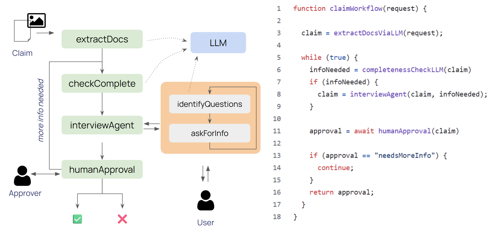

# Agentic Claim Processing Workflow with Restate

Recording: https://drive.google.com/file/d/1OtyOe7e9EhkOD828UYfTyME647oAMI4T/view?usp=sharing




See [https://restate.dev/](https://restate.dev/) for more about Restate.


# Services

You need to start the following processes:

* Agent Services (with the workflow code): `npm run dev` (will listen at 9080)

* User interview web ui: `npm run chatapp` (will listen at 3000)

* Interview requests `npm run usernotivy`. This simulates the email inbox of the user where links to the interview chat sessions get sent.

* Human-in-the-loop approval `npm run approver`. This simulates the inbox of the reviewer and prints review requests to the terminal.

# Connect Services

You need to register the agent services at Restate. Use the webui at [localhost:9070](http://localhost:9070) and click register and put the URL `http://localhost:9080` for ther services.


# Sample invocation

```bash
curl localhost:8080/claims/process -H 'idempotency-key: abc' --json '{
  "amount": 1000,
  "description": "my iPhone was dropped and now it is broken",
  "images": [
    "./pictures/broken_iphone.png"
  ],
  "user": {
    "email": "sam@gmail.com",
    "name": "Samuel Gauthier"
  }
}'
```

# Optional: Connecting Kafka

(1) Start Kafka by doing `docker compose up` in the `./kafka` directory.

(2) Put events into Kafka via the console producer

```bash
docker run --rm -it --net=host confluentinc/cp-kafka:7.5.0 /bin/bash
kafka-console-producer --topic claims --bootstrap-server localhost:9092
```

Sample events
```
{ "amount": 2000, "description": "some stone hit my windshield", "images": [ "./pictures/windshield.jpg" ], "user": { "email": "a@b.com", "name": "Anders Barthia" } }

{ "amount": 3500, "description": "A bird crashed into my MacBook", "images": [ "./pictures/broken_macbook.jpg" ], "user": { "email": "c@d.com", "name": "Charles Dickens" } }

{ "amount": 400, "description": "My toaster went up in flames. The toaster is broken, but I also needed to repaint some parts of the kitchen.", "images": [ "./pictures/broken_toaster.png" ], "user": { "email": "e@f.com", "name": "Emily Foster" } }
```

Unprocessable event (without code update) because references non-existing image
```
{ "amount": 400, "description": "My toaster went up in flames. The toaster is broken, but I also needed to repaint some parts of the kitchen.", "images": [ "./pictures/broken_toaster.jpg" ], "user": { "email": "e@f.com", "name": "Emily Foster" } }
```

(3) Create subscription

```bash
curl localhost:9070/subscriptions --json '{
  "source": "kafka://my-cluster/claims",
  "sink": "service://claims/process",
  "options": {"auto.offset.reset": "earliest"}
}'
```
