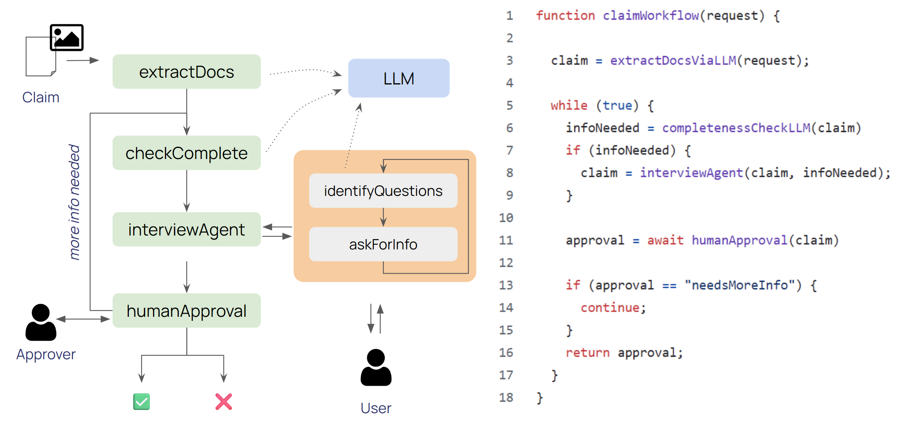

# Agentic Claim Processing Workflow with Restate

(Older recording: https://drive.google.com/file/d/1OtyOe7e9EhkOD828UYfTyME647oAMI4T/view?usp=sharing )




See [https://restate.dev/](https://restate.dev/) for more about Restate.


# Requirements

This demo runs on **Restate 1.7** (or newer) and **Node.js 22+**.


# Services

You need to start the following processes:

* **Agent services** (the workflow code: claim agent, interview agent, image analyzer).
`npm run dev` runs an instance with hot reload, listening at `9080`.

* **Chat UI** `npm run chatapp` (listens at `3000`) is the user's interview chat

* **Reviewer UI** `npm run approver` (listens at `55443`) simulates the human reviewer's inbox.

# Connect Services

You need to register the agent deployment(s) at Restate. Open the Restate UI at [localhost:9070](http://localhost:9070), click "Register deployment", and enter the URL `http://localhost:9080`.

# Sample invocation

Single image:
```bash
curl localhost:8080/claims/process -H 'idempotency-key: abc' --json '{
  "amount": 1000,
  "description": "my iPhone was dropped and now it is broken",
  "images": [
    "./pictures/broken_iphone.png"
  ],
  "user": {
    "email": "sam@gmail.com",
    "name": "Samuel Gauthier"
  }
}'
```

Three images (analyzed in parallel):
```bash
curl localhost:8080/claims/process -H 'idempotency-key: def' --json '{
  "amount": 2500,
  "description": "my car was hit by a falling tree branch during the storm, damaging the windshield and hood",
  "images": [
    "./pictures/windshield1.jpg",
    "./pictures/windshield2.jpg",
    "./pictures/windshield3.jpg"
  ],
  "user": {
    "email": "sam@gmail.com",
    "name": "Samuel Gauthier"
  }
}'
```

# Optional: Connecting Kafka

Restate manages Kafka clusters at runtime through the Admin API / CLI.

(1) Start Kafka via `docker compose up` in the `./kafka` directory.

(2) Register the Kafka cluster with Restate.

Using the Restate CLI:
```bash
restate kafka-clusters create my-cluster bootstrap.servers=localhost:9092
```

Or via the Admin API:
```bash
curl localhost:9070/kafka-clusters --json '{
  "name": "my-cluster",
  "properties": { "bootstrap.servers": "localhost:9092" }
}'
```

(3) Create the subscription that forwards events from the `claims` topic to the `claims/process` handler.

Using the Restate CLI:
```bash
restate subscriptions create kafka://my-cluster/claims service://claims/process auto.offset.reset=earliest
```

Or via the Admin API:
```bash
curl localhost:9070/subscriptions --json '{
  "source": "kafka://my-cluster/claims",
  "sink": "service://claims/process",
  "options": {"auto.offset.reset": "earliest"}
}'
```

(4) Put events into Kafka via the console producer

```bash
docker run --rm -it --net=host confluentinc/cp-kafka:7.5.0 /bin/bash
kafka-console-producer --topic claims --bootstrap-server localhost:9092
```

Sample events
```
{ "amount": 2000, "description": "some stone hit my windshield", "images": [ "./pictures/windshield.jpg" ], "user": { "email": "a@b.com", "name": "Anders Barthia" } }

{ "amount": 3500, "description": "A bird crashed into my MacBook", "images": [ "./pictures/broken_macbook.jpg" ], "user": { "email": "c@d.com", "name": "Charles Dickens" } }

{ "amount": 400, "description": "My toaster went up in flames. The toaster is broken, but I also needed to repaint some parts of the kitchen.", "images": [ "./pictures/broken_toaster.png" ], "user": { "email": "e@f.com", "name": "Emily Foster" } }
```

Unprocessable event (without code update) because references non-existing image
```
{ "amount": 400, "description": "My toaster went up in flames. The toaster is broken, but I also needed to repaint some parts of the kitchen.", "images": [ "./pictures/broken_toaster.jpg" ], "user": { "email": "e@f.com", "name": "Emily Foster" } }
```
